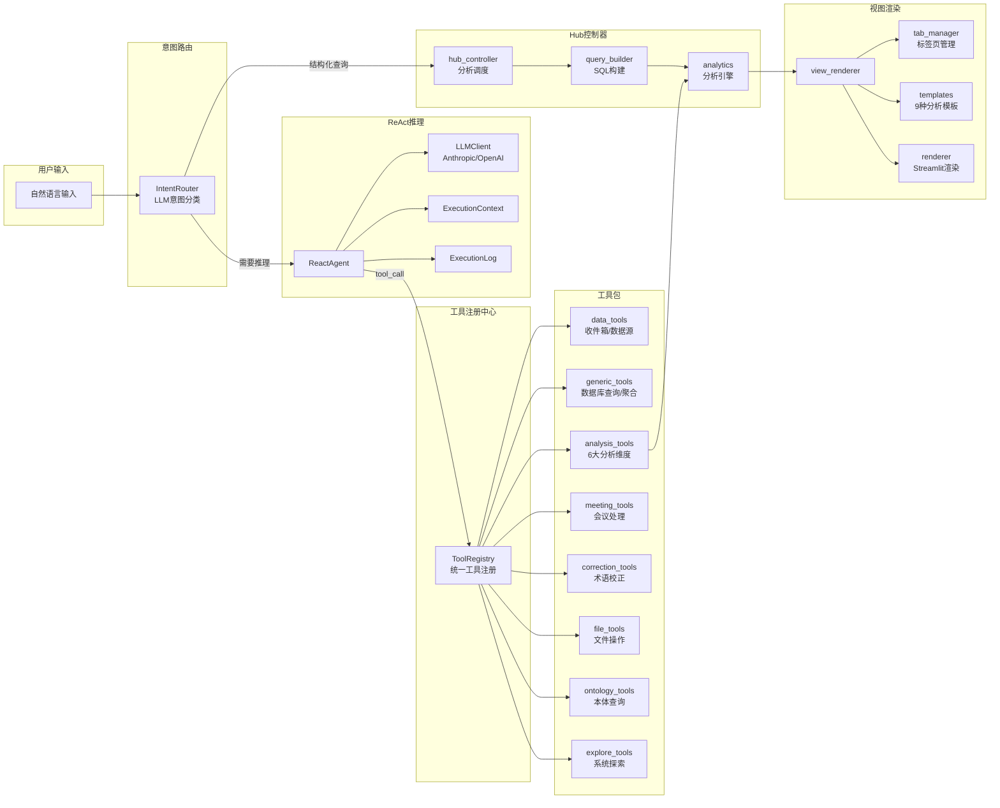
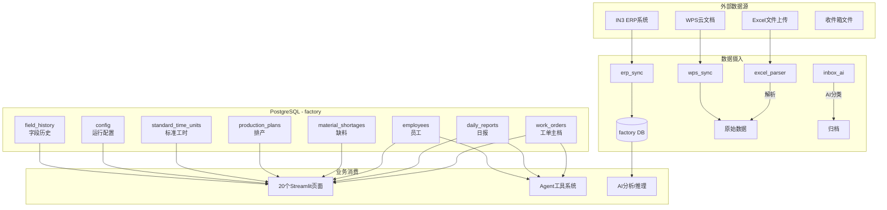

# 工厂工时管理系统 — 架构全景图

> 生成时间: 2026-06-23 | 基于当前代码库实测分析

---

## 一、系统分层架构

```mermaid
graph TB
    subgraph 用户层
        U1[班组长/操作员]
        U2[IE工程师/PMC]
        U3[生产主管/Admin]
    end

    subgraph 入口层
        APP[app.py<br/>Streamlit 入口]
        LOGIN[core.auth<br/>登录 + 角色控制]
        THEME[core.auth.apply_global_theme<br/>深色工业风CSS注入]
    end

    subgraph AI交互层
        COPILLOT[16_智能助理<br/>Copilot Hub]
        ROUTER[IntentRouter<br/>意图路由]
        REACT[ReactAgent<br/>ReAct推理循环]
        WIDGET[copilot_widget<br/>内嵌Copilot]
    end

    subgraph 页面层
        P0[0_项目报工]
        P1[1_组长报工]
        P2[2_今日总览]
        P3[3_设备维度]
        P4[4_人员维度]
        P5[5_工单进度]
        P6[6_效率看板]
        P7[7_标准工时健康度]
        P8[8_缺料跟踪]
        P9[9_系统配置]
        P10[10_BOM展开]
        P11[11_人员看板]
        P12[12_因果分析]
        P13[13_来源追溯]
        P14[14_本体视图]
        P15[15_数据同步]
        P17[17_生产计划]
        P18[18_派工建议]
        P20[20_收件箱管理]
        P21[21_在职人员清单]
    end

    subgraph 业务逻辑层
        direction LR
        ST[standard_time<br/>标准工时计算]
        TS[time_split<br/>工时拆分]
        DEV[deviation<br/>偏差/效率]
        OT[overtime<br/>加班计算]
        DR[delivery_risk<br/>交期风险]
        PR[production_risk<br/>生产风险]
        PP[production_plan<br/>排产计划]
        SK[skill_matrix<br/>技能矩阵]
        DS[dispatch_suggester<br/>派工建议]
        BC[bom_clustering<br/>BOM聚类]
        DQ[data_quality_check<br/>数据质量]
    end

    subgraph AI能力层
        direction LR
        OE[ontology_engine<br/>本体引擎]
        CR[conflict_resolver<br/>冲突解决]
        FH[field_history<br/>字段历史]
        TC[term_corrector<br/>术语纠正]
        MP[meeting_processor<br/>会议处理]
        IA[inbox_ai<br/>收件箱AI]
        DRG[data_reasoning<br/>数据推理]
        DC[data_connectors<br/>数据连接器]
    end

    subgraph 数据层
        DB[core.db<br/>SQLAlchemy引擎]
        DBF[core.database<br/>业务查询封装]
        MEM[memory<br/>记忆/快照]
        ERP[erp_sync / erp_integration<br/>ERP集成]
        EXCEL[excel_parser<br/>Excel解析]
        PG[(PostgreSQL<br/>factory)]
        EX[(ERP外部系统)]
    end

    APP --> LOGIN --> THEME
    APP --> COPILLOT
    APP --> P0 & P1 & P2 & P3 & P4 & P5 & P6 & P7 & P8 & P9 & P10 & P11 & P12 & P13 & P14 & P15 & P17 & P18 & P20 & P21

    COPILLOT --> ROUTER --> REACT
    COPILLOT --> WIDGET
    WIDGET --> REACT
    REACT --> |调用工具| OE & CR & TC & IA & DRG & DC & SK & DS

    P0 & P1 & P2 --> DBF
    P3 & P4 & P5 & P6 --> DB
    P7 --> DBF
    P8 --> DB
    P12 & P13 & P14 --> OE
    P17 --> PP
    P18 --> DS --> SK
    P11 --> EXCEL

    DB --> PG
    ERP --> EX
```



---

## 二、Agent 子系统架构（智能助理核心）



---

## 三、用户使用路径

### 路径 A：班组长日常报工

```
打开系统 → 自动跳转「16_智能助理」
         ↓
  ┌─ 路径1: 自然语言报工
  │   输入: "张三今天在WO-2026-001上干了8小时"
  │   → IntentRouter 识别为报工意图
  │   → hub_controller → form_actions.submit_daily_report()
  │   → core.db 写入 daily_reports 表
  │
  └─ 路径2: 传统页面报工
      侧边栏 → 「1_组长报工」
      → 选员工 → 选工单 → 填工时 → 提交
      → copilot_widget 可选AI自动填充
      → time_split.split_simple() 拆分工时
      → database.save_daily_report() 写入
```

### 路径 B：IE工程师分析效率

```
侧边栏 → 「6_效率看板」
  → 选择日期范围
  → deviation.calculate_efficiency()
  → 展示: 实际工时 vs 标准工时 偏差率

侧边栏 → 「7_标准工时健康度」
  → database.get_std_time_units()
  → 常量 QUALITY_LEVELS 分类
  → 展示: 数据质量分布

侧边栏 → 「10_BOM展开」
  → 选工单 → bom_clustering.cluster_bom()
  → bom_clustering.generate_operations()
  → 展示: 工序拆解方案
```

### 路径 C：PMC监控交期

```
侧边栏 → 「5_工单进度」
  → delivery_risk.calc_all_risks()
  → 展示: 每张工单 实际工时/标准工时/交期风险

侧边栏 → 「8_缺料跟踪」
  → 查询 material_shortages 表
  → 关联工单交期
  → 展示: 缺料KPI + 明细

侧边栏 → 「17_生产计划」
  → 上传 Excel → production_plan.parse_excel()
  → production_risk.calculate_all_risks()
  → 展示: 计划视图 + 甘特图 + 风险
```

### 路径 D：管理员全景分析

```
侧边栏 → 「2_今日总览」  → 当日报工一览
侧边栏 → 「3_设备维度」  → delivery_risk + 按设备聚合
侧边栏 → 「4_人员维度」  → overtime.calc_all_monthly_overtime()
侧边栏 → 「11_人员看板」 → personnel_data.build_daily_snapshot()
侧边栏 → 「18_派工建议」 → dispatch_suggester.suggest_dispatch()
侧边栏 → 「9_系统配置」  → 7个Tab管理全系统
```

### 路径 E：AI深度分析（高级）

```
「12_因果分析」
  → OntologyEngine.trace_causality()
  → 输入工单号 → 追溯: 工单→工人→物料 因果链

「13_来源追溯」
  → OntologyEngine + ConflictResolver + field_history
  → 查看某条记录的所有数据来源和变更历史

「14_本体视图」
  → 读取 config/ontology.json
  → 可视化: 8个业务对象 + 5组关系 + 2个动作
```

---

## 四、核心模块依赖热力图

```
被依赖次数 (数字=引用该模块的页面数)
━━━━━━━━━━━━━━━━━━━━━━━━━━━━━━━━━━━━━
core.auth           ████████████████████  20 (几乎全页面)
core.db             ████████████          12
core.database       █████████              9
core.memory         ███████                7
core.ontology_engine ███                   3
core.agent.copilot   ██                    2
core.delivery_risk   ██                    2
core.excel_parser    ██                    2
core.personnel_data  ██                    2
core.overtime        █                     1
core.deviation       █                     1
core.constants       █                     1
core.time_split      █                     1
core.bom_clustering  █                     1
core.dispatch_suggester █                  1
core.skill_matrix    █                     1
core.production_plan █                     1
core.production_risk █                     1
core.inbox_ai        █                     1
core.erp_integration █                     1
```

---

## 五、数据流总览



---

## 六、架构特点总结

| 特点 | 说明 |
|---|---|
| **双入口并存** | 首页跳转 Copilot 对话界面，侧边栏保留传统页面导航 |
| **Agent 是核心枢纽** | 智能助理(16)通过 IntentRouter 分流，可调用 8 大工具包共 40+ 工具 |
| **两套DB接口并存** | `core.db`(直接引擎) 和 `core.database`(业务封装) 同时存在，部分页面用A部分用B |
| **本体系统独立** | ontology_engine + conflict_resolver + field_history 构成独立的数据溯源体系 |
| **ERP双通道** | erp_sync(实时API同步) 和 erp_integration(Excel导入) 两条路径 |
| **模板化渲染** | Agent 分析结果通过 9 种模板(SummaryCard/DataTable/PersonTimesheet等)渲染 |
| **工厂场景适配** | 角色分级(admin/supervisor/operator)、深色工业风主题、大触控目标 |
